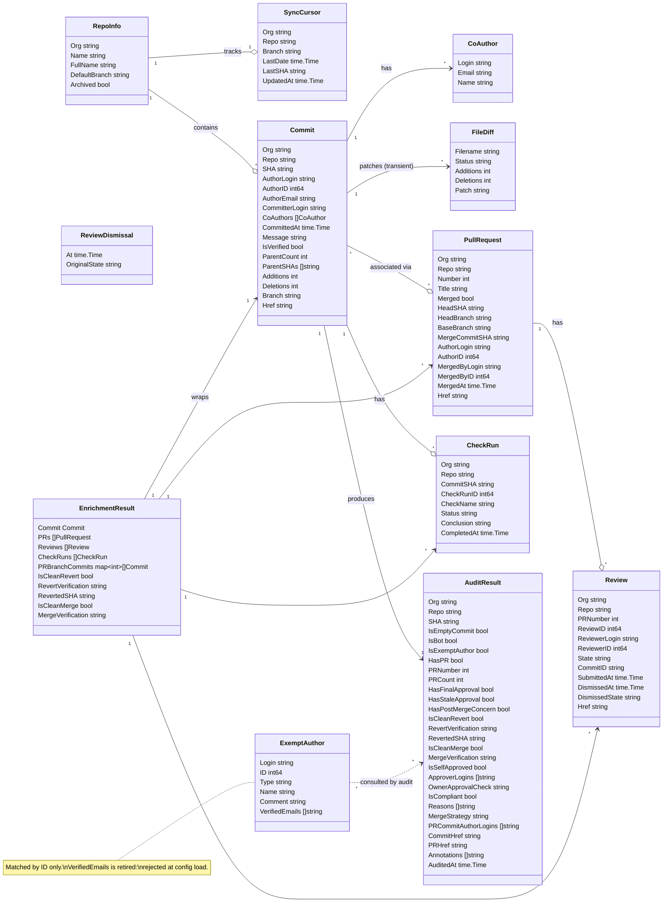

# model

Core domain types for gh-audit. See [`types.go`](types.go) for definitions.

## Type Relationships

```mermaid
classDiagram
    direction LR

    class RepoInfo {
        Org string
        Name string
        FullName string
        DefaultBranch string
        Archived bool
    }

    class SyncCursor {
        Org string
        Repo string
        Branch string
        LastDate time.Time
        LastSHA string
        UpdatedAt time.Time
    }

    class CoAuthor {
        Login string
        Email string
        Name string
    }

    class Commit {
        Org string
        Repo string
        SHA string
        AuthorLogin string
        AuthorID int64
        AuthorEmail string
        CommitterLogin string
        CoAuthors []CoAuthor
        CommittedAt time.Time
        Message string
        IsVerified bool
        ParentCount int
        ParentSHAs []string
        Additions int
        Deletions int
        Branch string
        Href string
    }

    class FileDiff {
        Filename string
        Status string
        Additions int
        Deletions int
        Patch string
    }

    class PullRequest {
        Org string
        Repo string
        Number int
        Title string
        Merged bool
        HeadSHA string
        HeadBranch string
        BaseBranch string
        MergeCommitSHA string
        AuthorLogin string
        AuthorID int64
        MergedByLogin string
        MergedByID int64
        MergedAt time.Time
        Href string
    }

    class Review {
        Org string
        Repo string
        PRNumber int
        ReviewID int64
        ReviewerLogin string
        ReviewerID int64
        State string
        CommitID string
        SubmittedAt time.Time
        DismissedAt time.Time
        DismissedState string
        Href string
    }

    class ReviewDismissal {
        At time.Time
        OriginalState string
    }

    class CheckRun {
        Org string
        Repo string
        CommitSHA string
        CheckRunID int64
        CheckName string
        Status string
        Conclusion string
        CompletedAt time.Time
    }

    class EnrichmentResult {
        Commit Commit
        PRs []PullRequest
        Reviews []Review
        CheckRuns []CheckRun
        PRBranchCommits map~int~[]Commit
        IsCleanRevert bool
        RevertVerification string
        RevertedSHA string
        IsCleanMerge bool
        MergeVerification string
    }

    class AuditResult {
        Org string
        Repo string
        SHA string
        IsEmptyCommit bool
        IsBot bool
        IsExemptAuthor bool
        HasPR bool
        PRNumber int
        PRCount int
        HasFinalApproval bool
        HasStaleApproval bool
        HasPostMergeConcern bool
        IsCleanRevert bool
        RevertVerification string
        RevertedSHA string
        IsCleanMerge bool
        MergeVerification string
        IsSelfApproved bool
        ApproverLogins []string
        OwnerApprovalCheck string
        IsCompliant bool
        Reasons []string
        MergeStrategy string
        PRCommitAuthorLogins []string
        CommitHref string
        PRHref string
        Annotations []string
        AuditedAt time.Time
    }

    class ExemptAuthor {
        Login string
        ID int64
        Type string
        Name string
        Comment string
        VerifiedEmails []string
    }
    note for ExemptAuthor "Matched by ID only.\nVerifiedEmails is retired:\nrejected at config load."

    RepoInfo "1" --o "*" Commit : contains
    RepoInfo "1" --o "1" SyncCursor : tracks
    Commit "*" --o "*" PullRequest : associated via
    PullRequest "1" --o "*" Review : has
    Commit "1" --o "*" CheckRun : has
    Commit "1" --> "*" FileDiff : patches (transient)
    EnrichmentResult "1" --> "1" Commit : wraps
    EnrichmentResult "1" --> "*" PullRequest
    EnrichmentResult "1" --> "*" Review
    EnrichmentResult "1" --> "*" CheckRun
    Commit "1" --> "*" CoAuthor : has
    Commit "1" --> "1" AuditResult : produces
    ExemptAuthor "*" ..> "*" AuditResult : consulted by audit
```
